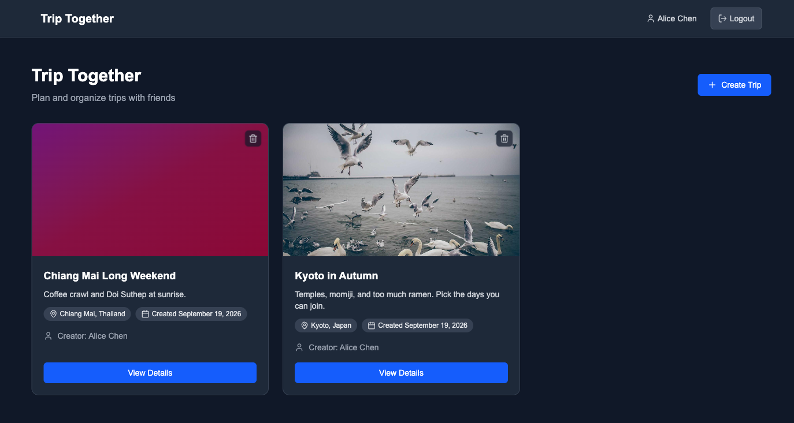
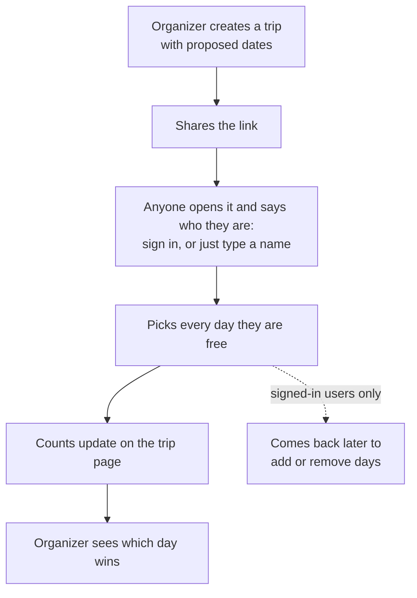
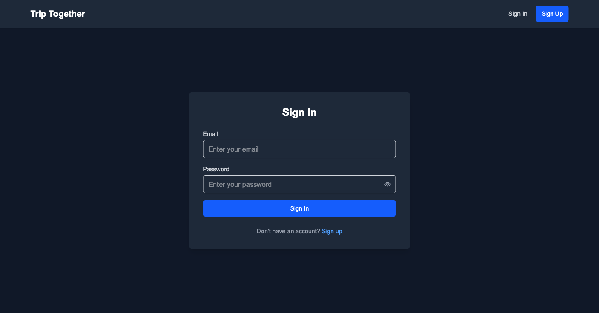
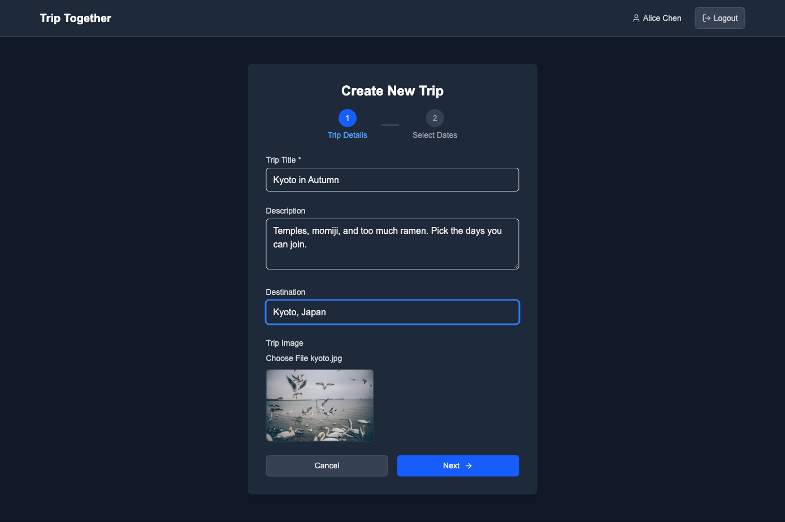
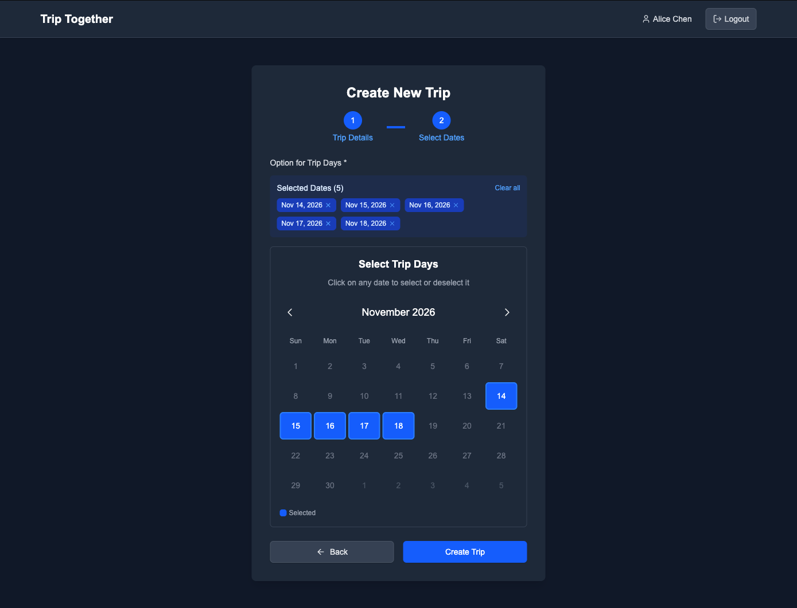
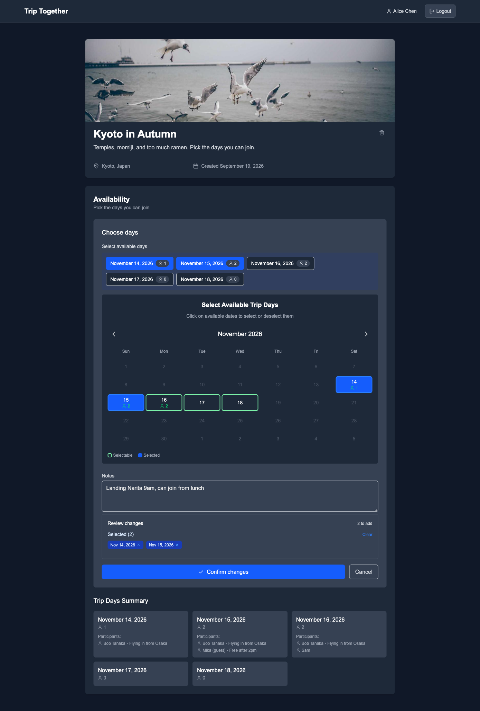
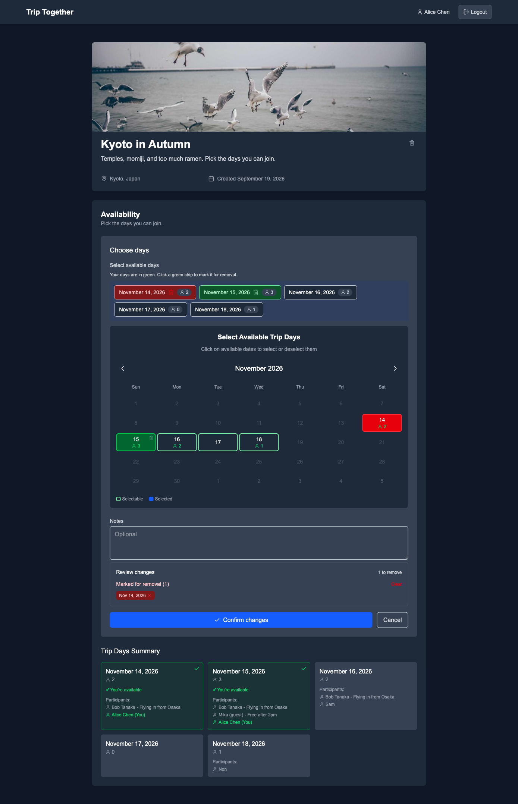
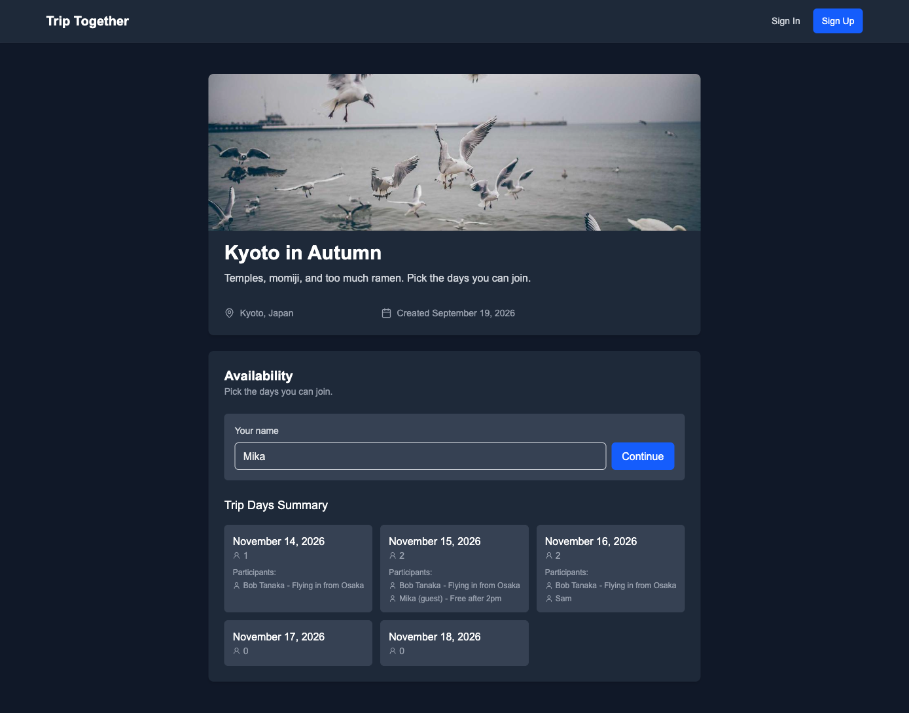
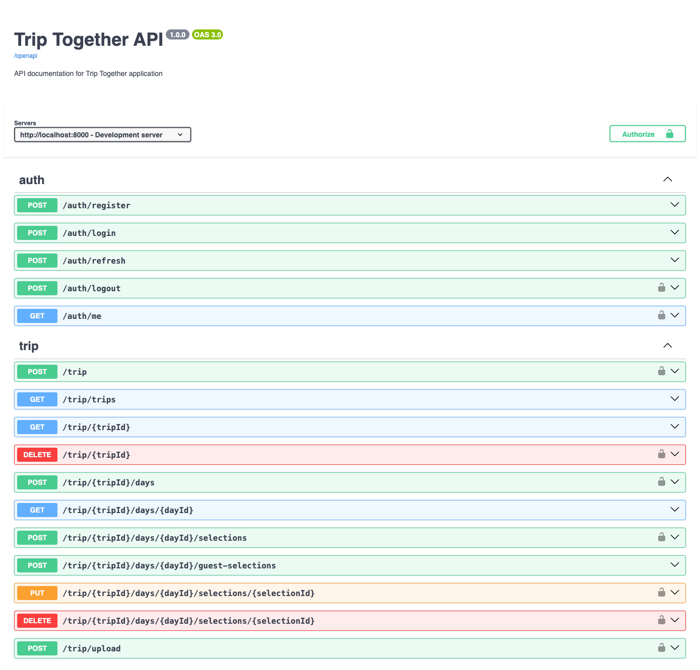
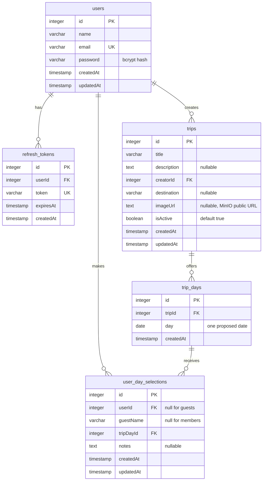

# Trip Together

Find the day that works for everyone.

Planning a trip in a group chat gets messy: people reply at different times, some never reply, and nobody sees the full picture. Trip Together fixes that: the organizer creates a trip with a few proposed dates and shares the link. Everyone marks the days they can join, and the count stays on one page.

**Your friends don't need an account.** Only the organizer signs up.



---

## What it does

| Feature                                                                | Who can do it   |
| ---------------------------------------------------------------------- | --------------- |
| Browse all trips                                                       | Anyone          |
| Create a trip — title, description, destination, photo, proposed dates | Signed-in users |
| Delete a trip, along with its days and picks                           | Creator         |
| Open a trip and see who picked what                                    | Anyone          |
| Pick and unpick several days at once, with a note                      | Signed-in users |
| Remove a day you picked, or edit your note                             | Signed-in users |
| Pick days as a guest, name only                                        | Anyone          |
| Add another day to a trip                                              | Creator         |
| Upload a trip photo                                                    | Signed-in users |

---

## User journey



Guests and members do the same thing. Only two things differ: a member signs in instead of typing a name, and only a member can change a pick later.

The app stops at the count. Announcing the final date still happens in the group chat.

---

## Technologies

**Frontend** — Next.js 15 (App Router, Turbopack), React 19, Tailwind CSS v4, react-hook-form + Zod, axios, lucide-react.

**Backend** — Bun, Hono + `@hono/zod-openapi`, Drizzle ORM, PostgreSQL 17, MinIO, JWT + bcrypt.

Two details worth knowing:

- Every route carries its own Zod schema, and the OpenAPI spec is generated from those schemas. The API docs cannot fall out of sync with the code.
- An axios interceptor asks for a new access token after a 401 and retries the request, so a session never breaks in the middle of an action.

---

## Quick tour

### 1. Sign in



Access tokens last 15 minutes, refresh tokens 7 days. Refresh tokens are stored in the database, so signing out revokes them.

### 2. Create a trip





These dates are options, not a final plan. The point is to find out which ones work for the group.

### 3. Everyone marks their days



Picks are only saved when you press _Confirm changes_, so a wrong click is easy to undo.

### 4. Change your mind



Your own days turn green. Click a green day to mark it for removal, then press *Confirm changes*. Adding and removing happen in the same step, and you can edit your note at any time.

### 5. Guests join without an account



A guest can mark as many days as they are free for, exactly like a member. The one difference: a guest cannot undo a pick afterwards.

### 6. API docs are generated from the code



Open `http://localhost:8000/docs`.

---

## Database structure

Five tables. Every foreign key cascades on delete, so removing a trip also removes its days and picks.



`user_day_selections` holds members and guests in one table. A member row has `userId`, a guest row has `guestName`. That is why guests need no account: a pick belongs to a day, not to an account.

One rule lives in the handler code rather than in the database: the same person, member or guest, can pick each day only once.

---

## API

Base URL `http://localhost:8000`. **Yes** means the request needs an `Authorization: Bearer <accessToken>` header.

| Method | Endpoint                                               | Auth | What it does                               |
| ------ | ------------------------------------------------------ | ---- | ------------------------------------------ |
| POST   | `/auth/register`                                       | No   | Create an account                          |
| POST   | `/auth/login`                                          | No   | Return an access token and a refresh token |
| POST   | `/auth/refresh`                                        | No   | Return a new access token                  |
| POST   | `/auth/logout`                                         | Yes  | Revoke the refresh token                   |
| GET    | `/auth/me`                                             | Yes  | Return the current user                    |
| POST   | `/trip`                                                | Yes  | Create a trip with its proposed dates      |
| GET    | `/trip/trips`                                          | No   | List trips with creator names              |
| GET    | `/trip/{tripId}`                                       | No   | One trip with its days and picks           |
| DELETE | `/trip/{tripId}`                                       | Yes  | Delete a trip — creator only               |
| POST   | `/trip/{tripId}/days`                                  | Yes  | Add another day — creator only             |
| GET    | `/trip/{tripId}/days/{dayId}`                          | No   | One day with its picks                     |
| POST   | `/trip/{tripId}/days/{dayId}/selections`               | Yes  | Mark yourself available                    |
| POST   | `/trip/{tripId}/days/{dayId}/guest-selections`         | No   | Add a guest to a day                       |
| PUT    | `/trip/{tripId}/days/{dayId}/selections/{selectionId}` | Yes  | Edit a note                                |
| DELETE | `/trip/{tripId}/days/{dayId}/selections/{selectionId}` | Yes  | Remove a pick                              |
| POST   | `/trip/upload`                                         | Yes  | Upload a photo — multipart `file`, max 5MB |

Every endpoint except `/trip/upload` is documented at `/docs`.

---

## How to run

You need [Bun](https://bun.sh) 1.2 or newer, Docker, and ports 3000, 5432, 8000, 9000 and 9001 free.

```bash
cp server/env.example server/.env
cp client/env.example client/.env

cd server && make infra-dev-up
docker exec postgres psql -U postgres -c "CREATE DATABASE trip_together;"

cd server && bun install && bun run dev    # API on :8000
cd client && bun install && bun run dev    # web on :3000
```

Open http://localhost:3000. Migrations run when the server starts. Stop the containers with `make infra-dev-down`.

Change the JWT secrets in `server/.env` before you deploy this anywhere public.

### Scripts

| Command                          | Where  | What it does                             |
| -------------------------------- | ------ | ---------------------------------------- |
| `bun run dev`                    | both   | Dev server with hot reload               |
| `bun run build`, `bun run start` | both   | Build and serve for production           |
| `bun run db:generate`            | server | Generate a migration from schema changes |
| `bun run db:push`                | server | Push the schema without a migration file |
| `bun run db:studio`              | server | Open Drizzle Studio                      |
| `bun run lint`                   | client | Run ESLint                               |

---

## Project layout

```
client/
  src/app/              pages: /, /login, /register, /trips/create, /trips/[id]
  src/components/       auth forms, TripCard, CreateTripForm, Calendar
  src/contexts/         AuthContext — user state, sign in, sign out
  src/lib/api.ts        axios instance, token refresh, typed API calls
server/
  src/db/               Drizzle schema and connection
  src/lib/              JWT and bcrypt helpers, MinIO storage, auto-migrate, OpenAPI app
  src/middleware/       auth guard, request logger
  src/routes/
    auth/               *.routes.ts = OpenAPI definitions, *.index.ts = handlers
    trips/
  drizzle/              migration files
  deployment/           docker-compose files for postgres and minio
```

`*.routes.ts` describes the endpoint with Zod, and `*.index.ts` implements it. Adding an endpoint means writing both.

---

## License

MIT — see [LICENSE](LICENSE).
